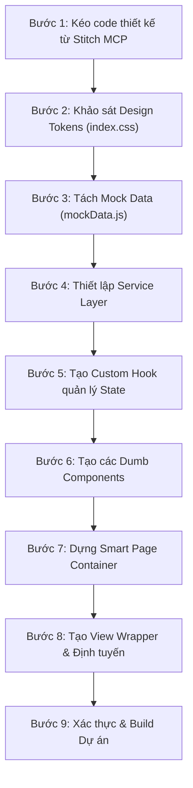

# EduSpace - Hướng Dẫn Dành Cho AI Agent (Agent Rules & Guidelines)

Dự án **SWP391-Group2-EduSpace** là một hệ thống quản lý học tập trực tuyến (LMS) được xây dựng trên mô hình Client-Server. Tài liệu này nhằm mục đích hướng dẫn các AI Agent (Cursor, Antigravity, Cline, Copilot) tuân thủ đúng kiến trúc, phong cách viết mã và các quy tắc đặc thù của dự án này.

---

## 1. Tổng Quan Công Nghệ (Technology Stack)

### Frontend
- **Framework**: React 19 (Vite)
- **Routing**: React Router 7 (sử dụng gói `react-router` mới nhất)
- **Styling**: Tailwind CSS v4.0.0 (với `@tailwindcss/vite`)
- **UI Components**: Shadcn UI (sử dụng Radix UI và cva)
- **API Client**: Axios (đã tích hợp JWT interceptor và NProgress bar)
- **Thông báo**: Sonner toast
- **Quản lý state**: React Context (`AuthContext` kết hợp với `useAuth` hook)

---

## 2. Quy Tắc Phát Triển Frontend (Frontend Guidelines)

AI Agent khi phát triển hoặc chỉnh sửa Frontend cần tuân thủ cấu trúc thư mục dạng **Modular** (Phát triển theo module tính năng) thay vì gom nhóm toàn bộ theo loại file:

```text
frontend/src/
├── components/          # Shared/Common components
│   ├── ui/              # Shadcn UI components (Button, Input, Badge...)
│   └── common/          # Layout, Navigation, RouteProgressBar...
├── contexts/            # React Contexts (AuthContext...)
├── lib/                 # Lib configs (axios.js, utils.js...)
├── modules/             # [MANDATORY] Module-based features
│   ├── auth/            # Module đăng nhập/đăng ký
│   │   ├── components/  # Components nội bộ module (LoginForm...)
│   │   ├── pages/       # Các trang của module (LoginPage...)
│   │   └── index.js     # File export chính của module
│   ├── course-lifecycle/# Module quản lý vòng đời khóa học
│   ├── course-enrollment/# Module đăng ký và ghi danh khóa học
│   ├── roadmap/         # Module lộ trình học tập
│   └── shared-features/ # Module các tính năng dùng chung (UserProfile...)
├── routes/              # Cấu hình Route nâng cao (ProtectedRoute...)
├── services/            # Tầng giao tiếp API (authService, courseService...)
├── utils/               # Tiện ích dùng chung (decodeToken, runWithLoading...)
└── views/               # [MANDATORY] Điểm đích của Router (chỉ import/wrap module pages)
```

### Quy tắc quan trọng về File & Components:
1. **Module Isolation**: Mọi tính năng mới phải nằm trong thư mục `src/modules/<feature-name>`. Tránh tạo các page lớn trực tiếp ở `src/views` mà không qua module tương ứng.
2. **Views wrapping**: `src/views` chỉ đóng vai trò là "Router Entry Points" (Điểm phân tuyến). File ở đây sẽ import page thực tế từ `src/modules` và wrap thêm Layout (Header, Footer, Sidebar) nếu cần.
   - *Ví dụ*: `src/views/auth/Login.jsx` chỉ import và render `<LoginPageView />` từ `@/modules/auth/pages/LoginPage`.
3. **Shadcn UI**: Không tự viết lại CSS/Tailwind cho các thành phần UI cơ bản (Button, Input, Badge, Dialog, Modal,...). Hãy sử dụng hoặc mở rộng từ `@/components/ui`.
4. **API Integration**:
   - Tất cả các yêu cầu API phải sử dụng instance `api` được cấu hình sẵn trong `@/lib/axios.js` (đã có tự động đính kèm Token và thanh tiến trình NProgress).
   - Định nghĩa hàm gọi API tại `@/services/<feature>Service.js`.
5. **Async Handling**: Sử dụng hàm helper `runWithLoading(setLoading, asyncFn)` từ `@/utils/utils` để đồng bộ trạng thái loading khi thực hiện các tác vụ bất đồng bộ trong UI, tránh việc viết lặp đi lặp lại `try-catch-finally` để set loading.
6. **Import Alias**: Luôn sử dụng alias `@/` khi import các file trong Frontend thay vì dùng đường dẫn tương đối phức tạp (ví dụ: dùng `import Button from "@/components/ui/Button"` thay vì `import Button from "../../components/ui/Button"`).

### 2.1. Chi Tiết API Contract & Cấu Trúc Core (Core Contracts)

#### 1. AuthContext & useAuth Hook (`@/contexts/AuthContext`)
Mọi tác vụ liên quan đến xác thực người dùng phải thông qua hook `useAuth()`. Đối tượng trả về có cấu trúc như sau:
- **user**: `Object | null` - Thông tin tài khoản đăng nhập thành công. Cấu trúc đối tượng `user`:
  ```typescript
  {
    id: string;          // ID người dùng
    username: string;    // Tên tài khoản
    fullName: string;    // Tên đầy đủ
    email: string;       // Địa chỉ email
    avatarUrl: string | null; // Đường dẫn ảnh đại diện
    role: "ADMIN" | "CREATOR" | "USER" | string; // Vai trò của người dùng
  }
  ```
- **isLoading**: `boolean` - Trạng thái đang xác thực (khi tải trang hoặc gọi API phục hồi session).
- **login(username, password)**: `(username, password) => Promise<void>` - Hàm đăng nhập tài khoản.
- **logout()**: `() => void` - Hàm đăng xuất tài khoản.
- **checkAuth()**: `() => Promise<void>` - Kiểm tra thủ công và đồng bộ thông tin user từ Token hiện tại.

#### 2. ProtectedRoute (`@/routes/ProtectedRoute.jsx`)
Sử dụng làm component bảo vệ các route cần đăng nhập hoặc phân quyền:
- **Props**:
  - `allowedRoles`: `string[]` (Ví dụ: `["ADMIN"]`, `["CREATOR"]`) - Danh sách vai trò được phép truy cập. Nếu không truyền, chỉ yêu cầu đã đăng nhập (`user` khác `null`).
- **Hành vi xử lý (Behavior Contract)**:
  1. Nếu `isLoading` là `true`: Hiển thị màn hình loading (`Đang tải dữ liệu EduSpace...`).
  2. Nếu không có `user`: Chuyển hướng (`Navigate`) về trang chủ `/` kèm flag `replace`.
  3. Nếu có `user` nhưng `role` không nằm trong `allowedRoles`: Cảnh báo trên console và redirect về trang lỗi `/*`.
  4. Nếu hợp lệ: Hiển thị các route con bằng `<Outlet />`.

#### 3. Axios Interceptor (`@/lib/axios.js`)
Dự án sử dụng instance Axios `api` cấu hình tại thư mục `lib`. Agent không cần tự viết thêm header token hay cấu hình loading bar.
- **Hành vi**:
  - Bắt đầu/kết thúc thanh tiến trình `NProgress` tự động trên mỗi lượt request.
  - Tự động gắn header `Authorization: Bearer <access_token>` nếu có token tồn tại trong localStorage.
  - Trả lỗi trực tiếp qua `Promise.reject(error)` (không tự động redirect 401 ở interceptor).
- **Snippet cấu hình**:
  ```javascript
  const api = axios.create({
      baseURL: "http://localhost:8080/api"
  });

  api.interceptors.request.use(
      (config) => {
          NProgress.start();
          const token = getTokens();
          if (token) {
              config.headers.Authorization = `Bearer ${token}`;
          }
          return config;
      },
      (error) => {
          NProgress.done();
          return Promise.reject(error);
      }
  );

  api.interceptors.response.use(
      (response) => {
          NProgress.done();
          return response;
      },
      (error) => {
          NProgress.done();
          return Promise.reject(error);
      }
  );
  ```

#### 4. Khác Biệt Custom Props của UI Components (`@/components/ui/`)
Dự án sử dụng Shadcn UI làm nền tảng nhưng có customize một số component nội bộ:
- **Button (`Button.jsx`)**:
  - Hỗ trợ prop `isLoading` (`boolean`). Khi truyền `true`, tự hiển thị spinner và đặt thuộc tính `disabled`.
- **Badge (`Badge.jsx`)**:
  - Bổ sung variant `"roletag"`: Nền primary mờ, chữ primary đậm chuyên hiển thị Role người dùng.
  - Hỗ trợ prop `title` (`string`) thay thế cho `children` khi render text ngắn.
- **CardInformation (`CardInformation.jsx`)**:
  - Prop: `title` (tiêu đề card), `description` (mô tả card), `children` (nếu truyền sẽ ghi đè phần tiêu đề).
- **EmptyState (`EmptyState.jsx`)**:
  - Component hiển thị khi không có dữ liệu.
  - Prop: `icon` (Lucide Icon), `title` (tiêu đề), `description` (nội dung phụ), `children` (render nút hành động).
- **LogoutButton (`LogoutButton.jsx`)**:
  - Nút đăng xuất tích hợp sẵn hiệu ứng chờ 800ms, gọi `logout()` và redirect về trang cấu hình.
  - Prop: `redirectPath` (mặc định `/`), `iconSize` (mặc định 16), `children` (mặc định "Đăng xuất").
- **ReloadButton (`ReloadButton.jsx`)**:
  - Nút làm mới, tích hợp icon quay tròn khi tải.
  - Prop: `action` (hàm click handler), `isLoading` (boolean).
- **PrimaryButton (`PrimaryButton.jsx`)**:
  - Nút thiết kế chính với màu sắc đặc trưng của dự án.
  - Prop: `action` (hàm click handler), `title` (text nút).

---

## 2.2. Quy Tắc Đặt Tên (Naming Conventions)

Để đảm bảo code dễ đọc, dễ tìm kiếm và tránh lỗi import trên môi trường Linux (case-sensitive), Agent phải tuân thủ:

| Loại thành phần | Quy tắc đặt tên | File mẫu | Ví dụ cụ thể |
| :--- | :--- | :--- | :--- |
| **Common/UI Component** | PascalCase | `<Name>.jsx` | `Button.jsx`, `AvatarDropDown.jsx` |
| **Module Component** | PascalCase | `<Name>.jsx` | `LoginForm.jsx`, `LessonItem.jsx` |
| **Page Component** | PascalCase + Hậu tố `Page` | `<Name>Page.jsx` | `UserProfilePage.jsx`, `CourseManagementPage.jsx` |
| **Custom React Hook** | camelCase + Tiền tố `use` | `use<Name>.js` | `useAuth.js`, `useCourse.js` |
| **React Context** | PascalCase + Hậu tố `Context` | `<Name>Context.jsx` | `AuthContext.jsx` |
| **Service Layer** | camelCase + Hậu tố `Service` | `<name>Service.js` | `authService.js`, `courseService.js` |
| **Utility Helper** | camelCase | `<name>.js` | `utils.js`, `dateFormatter.js` |
| **Thư mục Module** | kebab-case | `<name>/` | `course-lifecycle/`, `shared-features/` |

---

## 2.3. Hợp Đồng Dữ Liệu API (API Response Contract)

Toàn bộ API từ backend đều sử dụng chung một cấu trúc phản hồi thống nhất định nghĩa qua lớp `APIResponse<T>` ở Spring Boot. Agent cần nắm rõ cấu trúc JSON này để bóc tách dữ liệu đúng tại Frontend:

### Cấu trúc chung của APIResponse JSON:
```json
{
  "isSuccess": true,  // boolean (true nếu thành công, false nếu thất bại)
  "code": 200,        // int (mã trạng thái HTTP: 200, 400, 403, 500,...)
  "message": "...",   // string (thông báo kết quả hoặc mô tả chi tiết lỗi)
  "data": null        // T (payload chứa dữ liệu trả về hoặc null nếu có lỗi)
}
```

### 1. Phản hồi thành công kèm dữ liệu (Standard Success Response)
```json
{
  "isSuccess": true,
  "code": 200,
  "message": "Thành công",
  "data": {
    "id": 12,
    "title": "React 19 Cơ Bản",
    "status": "PUBLISHED"
  }
}
```
*Lưu ý: Tầng Service ở Frontend đã tự động bóc tách và trả về trực tiếp phần `data` (tương ứng với `response.data.data`) cho component.*

### 2. Phản hồi thành công dạng thông báo (Standard Message Response)
```json
{
  "isSuccess": true,
  "code": 200,
  "message": "Đăng ký làm Creator thành công!",
  "data": null
}
```
*Lưu ý: Thường dùng ở các thao tác POST/PUT/DELETE không trả về object. Service trả về trực tiếp chuỗi `response.data.message`.*

### 3. Phản hồi lỗi hệ thống / lỗi nghiệp vụ (Standard Error Response)
```json
{
  "isSuccess": false,
  "code": 400,
  "message": "Không tìm thấy khóa học yêu cầu!",
  "data": null
}
```

### 4. Phản hồi lỗi Validation (Validation Error Response)
Khi validate dữ liệu đầu vào thất bại, Backend gom toàn bộ thông báo lỗi của các trường thành một chuỗi phân cách bởi dấu phẩy và trả về trong trường `message`:
```json
{
  "isSuccess": false,
  "code": 400,
  "message": "Email không đúng định dạng, Số điện thoại phải có 10 chữ số",
  "data": null
}
```
*Lưu ý: Frontend Service tự động bắt lỗi này từ `error.response?.data?.message` và throw thành Error để component hiển thị qua `toast.error`.*

---

## 2.4. Quy Tắc Xử Lý Lỗi (Error Handling Convention)

Để giữ trải nghiệm người dùng đồng nhất và không làm rác mã nguồn:
1. **API / Business Errors**:
   - Sử dụng **Sonner Toast** (`toast.error`) để thông báo lỗi từ API hoặc lỗi nghiệp vụ bất ngờ lên màn hình.
   - *Ví dụ*: `toast.error(error.message || "Đã xảy ra lỗi!")`.
2. **Validation Errors**:
   - Đối với form, hiển thị lỗi ngay bên dưới input có dữ liệu không hợp lệ bằng chữ màu đỏ (`text-red-500 text-xs mt-1`).
   - Không được dùng toast để báo lỗi validation của từng trường nhập đơn lẻ trừ khi là lỗi submit form chung.
3. **Quy định ghi log (Console Logging)**:
   - Chỉ dùng `console.error` trong catch block của Service hoặc Component với format: `console.error('<Nội dung lỗi> tại [Tên Component/Service]:', error)`. Điều này giúp trace lỗi nhanh trên browser console.

---

## 2.5. Lập Trình Biểu Mẫu (Form Development Rules)

Dự án hiện tại **không sử dụng** `react-hook-form` hay thư viện form bên ngoài. AI Agent bắt buộc phải phát triển form theo quy tắc **Controlled Component** truyền thống:

1. **Quản lý state**: Sử dụng `useState` để lưu trữ đối tượng form data.
2. **Phân rã Component**:
   - Form lớn nên chia thành các Component Presentation nhận props: `formData` (hoặc tên object cụ thể như `passwordForm`), `onChange`, `onSubmit`, và `isLoading`.
   - Parent (Smart Page) sẽ quản lý state và gọi API.
3. **Trạng thái vô hiệu hóa (Disabled/Loading State)**:
   - Nút Submit phải nhận prop `isLoading` để hiện spinner quay tròn và tự động chuyển sang trạng thái disabled.
   - Mọi `Input`, `Select`, `Textarea` phải tự động disabled khi form đang submit (`isLoading = true`).
4. **Ví dụ chuẩn (Controlled Form Pattern)**:
   ```jsx
   const [formData, setFormData] = useState({ title: "", description: "" });
   const [isSubmitting, setIsSubmitting] = useState(false);

   const handleChange = (e) => {
       const { name, value } = e.target;
       setFormData(prev => ({ ...prev, [name]: value }));
   };

   const handleSubmit = async (e) => {
       e.preventDefault();
       await runWithLoading(setIsSubmitting, async () => {
           try {
               await courseService.createCourse(formData);
               toast.success("Tạo khóa học thành công!");
           } catch (error) {
               toast.error(error.message);
           }
       });
   };
   ```

---

## 2.6. Quản Lý Trạng Thái (State Management Rules)

Dự án ưu tiên cấu trúc gọn nhẹ, tránh re-render diện rộng:
1. **useState & useReducer**: Sử dụng tối đa cho local state (mở đóng modal, tab, filter danh sách).
2. **React Context**:
   - Chỉ sử dụng khi dữ liệu cần chia sẻ xuyên suốt qua nhiều cấp component (như thông tin người dùng `AuthContext`).
   - **Tuyệt đối cấm** tạo Context mới cho một module cục bộ mà không có sự đồng ý của Technical Lead.
3. **Thư viện bên thứ ba**:
   - Dự án **nghiêm cấm tự ý cài đặt** `Zustand`, `Redux Toolkit`, `MobX`, `Recoil`, hoặc `Jotai`. Mọi trạng thái chia sẻ phải dùng React Context có sẵn.

---

## 2.7. Tầng Lấy Dữ Liệu (Data Fetching Rules)

Tách biệt hoàn toàn logic gọi mạng (network calls) ra khỏi component UI:
1. **Service Layer (`src/services/`)**:
   - Nơi duy nhất định nghĩa endpoints và phương thức gọi HTTP (GET, POST, PUT, DELETE) qua instance `api`.
   - Bắt buộc xử lý lỗi tại Service: log ra console và ném ra (`throw new Error(errorMsg)`) với `errorMsg` đã được định dạng rõ ràng từ phản hồi backend.
2. **Component Layer**:
   - Import Service và gọi trực tiếp trong các handler hoặc inside `useEffect`.
   - Không được phép import `axios` hoặc sử dụng `api` trực tiếp trong component để thực hiện fetch dữ liệu thô.
3. **Chính sách caching/fetching**:
   - Hiện tại dự án sử dụng state React để lưu trữ dữ liệu tải về. **Không được cài đặt** các thư viện như `React Query` (TanStack Query) hoặc `SWR` khi chưa được phê duyệt.

---

## 2.8. Bản Đồ Định Tuyến & Điều Hướng (Route Map & Navigation)

Hệ thống sử dụng **React Router 7**. Agent cần tuân thủ cấu trúc route sau:

### 1. Phân loại Route chính trong `App.jsx`
- **Public Routes**: `/` (Home), `/signup` (Đăng ký), `/login` (Đăng nhập), `/oauth2/redirect` (Google OAuth), `/roadmaps` (Lộ trình học), `/courses` (Danh sách khóa học), `/courses/:id` (Chi tiết khóa học).
- **User Routes** (Đăng nhập): `/profile` (Cá nhân), `/classes/:classId` (Lớp học/Xem bài học).
- **Creator Routes** (Đóng vai trò CREATOR): `/creator` (Dashboard), `/creator/courses` (Quản lý khóa học), `/creator/courses/:id/edit` (Chỉnh sửa bài giảng), `/creator/analytics` (Báo cáo số liệu).
- **Admin Routes** (Đóng vai trò ADMIN): `/admin` (Dashboard), `/admin/creator-requests` (Phê duyệt Creator), `/admin/courses-management` (Duyệt khóa học).

### 2. Hành vi điều hướng
- Sử dụng hook `useNavigate` từ `react-router` để chuyển hướng.
- Không được dùng `window.location.href` để điều hướng nội bộ (chỉ dùng khi redirect sang Google OAuth).

---

## 2.9. Ma Trận Phân Quyền (Authorization Matrix)

Agent phải dựa vào ma trận dưới đây để kiểm soát việc render UI (nút bấm, thanh điều hướng) và bảo vệ route:

| Tính Năng Frontend / Route | GUEST | USER | CREATOR | ADMIN |
| :--- | :---: | :---: | :---: | :---: |
| **Xem danh sách/chi tiết khóa học** | ✅ | ✅ | ✅ | ✅ |
| **Đăng ký học / Vào lớp học (`/classes/:id`)** | ❌ | ✅ | ❌ | ❌ |
| **Đăng ký làm Creator** | ❌ | ✅ | ❌ | ❌ |
| **Tạo/Sửa khóa học (`/creator/*`)** | ❌ | ❌ | ✅ | ❌ |
| **Xem phân tích doanh thu/học viên** | ❌ | ❌ | ✅ | ❌ |
| **Phê duyệt đơn đăng ký Creator** | ❌ | ❌ | ❌ | ✅ |
| **Duyệt/Khóa các khóa học hệ thống** | ❌ | ❌ | ❌ | ✅ |

---

## 2.10. Thiết Kế Component (Component Design Rules)

Tránh hiện tượng tạo ra "God Component" bằng các quy tắc thiết kế:
1. **Smart Component (Trang/Container)**:
   - Vị trí: `src/modules/<feature>/pages/` hoặc `src/views/`.
   - Trách nhiệm: Quản lý state, gọi api, xử lý auth, xử lý điều hướng, và truyền dữ liệu xuống các components con.
2. **Dumb Component (Component trình diễn)**:
   - Vị trí: `src/modules/<feature>/components/` hoặc `src/components/ui/` hoặc `src/components/common/`.
   - Trách nhiệm: Nhận props, render UI và gửi sự kiện lên component cha qua callbacks. Không tự ý gọi Service hoặc xử lý logic nghiệp vụ toàn cục.
3. **Giới hạn số dòng code**: Một file Component **không được vượt quá 300 dòng**. Nếu vượt quá, Agent bắt buộc phải phân rã component thành các sub-components nhỏ hơn.

---

## 2.11. Bản Thiết Kế Module Gốc (Module Blueprint)

Mọi thư mục module trong `src/modules/<feature>/` phải tuân thủ layout chuẩn:

```text
src/modules/<feature>/
├── components/          # Các Dumb Components nội bộ phục vụ tính năng này
│   ├── FeatureForm.jsx  # Form nhập liệu cục bộ
│   └── FeatureCard.jsx  # Card hiển thị dữ liệu cục bộ
├── pages/               # Các Smart Pages đại diện cho màn hình hoàn chỉnh
│   └── FeatureListPage.jsx
├── hooks/               # Custom hooks nội bộ module (nếu có)
│   └── useFeatureFilter.js
└── index.js             # Export duy nhất các Page components ra bên ngoài
```

*File `index.js` mẫu:*
```javascript
export { default as FeatureListPage } from "./pages/FeatureListPage";
```

---

## 2.12. Quy Tắc Kiểm Thử (Testing Rules)

1. **Hiện trạng dự án**: Giai đoạn hiện tại **chưa tích hợp** framework kiểm thử tự động (Jest/Vitest) ở Frontend.
2. **Quy trình kiểm thử**: 
   - Kiểm thử được thực hiện **thủ công** bằng cách chạy môi trường phát triển (`npm run dev`) và sử dụng browser hoặc browser subagent để kiểm tra luồng nghiệp vụ.
   - Khi dự án thêm framework test, các file test phải đặt tại thư mục `__tests__/` nằm kế bên file code được kiểm thử, đặt tên dạng `<tên_file>.test.js`.

---

## 2.13. Quy Trình Xây Dựng Một Trang Frontend Hoàn Chỉnh (Frontend Page Development Flow)

Khi phát triển một trang hoặc một tính năng Frontend mới (dù là tự dựng hay lấy giao diện từ Stitch MCP), AI Agent **bắt buộc** phải tuân thủ đúng quy trình 9 bước tuần tự sau:



### Hướng dẫn chi tiết từng bước:

1. **Bước 1: Kéo code/layout thiết kế từ Stitch MCP**
   - Trước khi tiến hành lập trình, AI Agent cần tìm hiểu màn hình thiết kế mẫu trong dự án Stitch bằng cách chạy các công cụ như `list_screens` hoặc `get_project`.
   - Chạy công cụ `get_screen` để tải về mã nguồn UI của thiết kế thô (hoặc sử dụng `generate_screen_from_text` nếu cần thiết kế mới dựa trên mô tả) nhằm có một khung giao diện thô hoàn chỉnh để chuẩn bị bóc tách logic.

2. **Bước 2: Khảo sát Design Tokens & Màu sắc (`index.css`)**
   - Trước khi sửa đổi mã nguồn thô vừa kéo về, cần mở file `index.css` để kiểm tra các biến HSL và màu sắc có sẵn.
   - **Tuyệt đối cấm** tự thêm màu sắc tùy ý ngoài bảng màu chuẩn của dự án. Hãy đối chiếu giao diện thô từ MCP và đổi các màu sắc của nó sang các class Tailwind có sẵn như `bg-primary`, `bg-secondary`, `bg-bg-base`, `text-neutral-dark`, `border-border-light`, v.v.

3. **Bước 3: Tách & định nghĩa Mock Data (`src/modules/<feature>/utils/mockData.js`)**
   - Trích xuất tất cả các đoạn văn bản hiển thị tĩnh, danh sách bài học, thông tin người dùng giả lập ra khỏi mã nguồn thô của component vừa kéo từ MCP về.
   - Định nghĩa chúng thành các biến JSON/Array xuất khẩu (`export`) rõ ràng để chuẩn bị cấu trúc dữ liệu tương thích với API Backend sau này.

4. **Bước 4: Thiết lập Service Layer (`src/services/<feature>Service.js`)**
   - Xây dựng tầng service chứa các phương thức tương tác API thông qua instance `api` đã được cấu hình từ `@/lib/axios.js`.
   - Nếu API Backend chưa sẵn sàng, hãy viết hàm giả lập với thời gian trễ (`delay`) mạng khoảng 200ms bằng `Promise` và trả về mock data từ **Bước 3**. Khi Backend hoàn thành, chỉ cần thay thế hàm giả lập bằng request Axios (`api.get`, `api.post`) là xong.

5. **Bước 5: Tạo Custom Hook quản lý State (`src/modules/<feature>/hooks/use<Feature>.js`)**
   - Khai báo tất cả các state (danh sách, tabs, đóng mở modal, dữ liệu nhập liệu) và các handler logic (gửi form, đổi trang, đánh dấu hoàn thành).
   - Tải dữ liệu bất đồng bộ từ Service Layer thông qua helper `runWithLoading` để tự động hóa việc hiển thị thanh chờ.
   - Trả về toàn bộ state và handler để tách biệt hoàn toàn phần Logic khỏi Giao diện hiển thị.

6. **Bước 6: Tạo các Dumb Components (Component Trình Diễn) (`src/modules/<feature>/components/`)**
   - Phân tách giao diện thô kéo từ MCP ở **Bước 1** thành các Dumb Components độc lập (ví dụ: `VideoPlayer.jsx`, `PairChat.jsx`, `CourseSidebar.jsx`).
   - Các components này **chỉ nhận dữ liệu** qua `props`, báo hiệu hành động qua callbacks, và sử dụng các UI components có sẵn như `<Badge />`, `<Button />` kết hợp với thư viện `lucide-react` thay vì tự vẽ SVG hoặc tự import Axios để gọi API.

7. **Bước 7: Dựng Smart Page Container (`src/modules/<feature>/pages/<Feature>Page.jsx`)**
   - Smart Page đóng vai trò làm trang tổng hợp: Gọi Custom Hook (đã dựng ở **Bước 5**) để lấy dữ liệu.
   - Quản lý trạng thái tải trang chung (nếu `isLoading` bằng `true` thì render màn hình chờ).
   - Sắp xếp layout chính của trang và truyền props tương ứng xuống các Dumb Components (đã dựng ở **Bước 6**).

8. **Bước 8: Tạo View Wrapper & Định tuyến (`src/views/`)**
   - Tạo file view wrapper tại `src/views/<feature>/<Feature>.jsx`. Đây là "Router Entry Point" dùng để bọc layout toàn trang (Header, Footer, hoặc Sidebar của hệ thống).
   - Đăng ký đường dẫn Router mới trong `src/App.jsx` dưới nhóm `ProtectedRoute` (nếu yêu cầu phân quyền) và chỉ định các role được truy cập.

9. **Bước 9: Xác thực & Build Dự án (`npm run build`)**
   - Sau khi hoàn thành, Agent bắt buộc phải chạy lệnh `npm run build` ở thư mục frontend.
   - Việc build giúp đảm bảo không phát sinh bất kỳ lỗi cú pháp nào, không import sai chữ hoa/chữ thường (gây lỗi khi triển khai CI/CD Linux), và không bị lỗi trùng lặp thuộc tính CSS/React.

---

## 3. Tích Hợp Stitch MCP & Thiết Kế (Stitch MCP Integration)

Dự án sử dụng **Stitch MCP** để quản lý các màn hình thiết kế (screens), các biến thể giao diện (variants), và hệ thống thiết kế (design system) đồng bộ với code. AI Agent được khuyến khích sử dụng các công cụ Stitch MCP để tự động hóa quá trình dựng giao diện.

### Các công cụ Stitch MCP chính và trường hợp sử dụng:
1. **Quản lý dự án & màn hình (Projects & Screens)**:
   - `list_projects` / `get_project`: Xem danh sách và thông tin chi tiết dự án thiết kế đang liên kết.
   - `list_screens` / `get_screen`: Liệt kê và đọc mã nguồn của các màn hình đã được dựng sẵn hoặc thiết kế mẫu.
2. **Sinh và chỉnh sửa màn hình (Generation & Editing)**:
   - `generate_screen_from_text`: Sinh giao diện React hoàn chỉnh dựa trên mô tả thiết kế dạng text của người dùng.
   - `edit_screens`: Gửi yêu cầu chỉnh sửa/cập nhật cấu trúc màn hình hiện tại dựa trên phản hồi UI.
   - `generate_variants`: Tạo các biến thể khác nhau của một màn hình hoặc component (ví dụ: giao diện sáng/tối, trạng thái rỗng, trạng thái lỗi).

### Quy Tắc Ưu Tiên Theme & Design System

Để đảm bảo tính nhất quán giao diện trên toàn bộ hệ thống EduSpace, AI Agent phải ưu tiên sử dụng bộ màu sắc, typography, spacing và design tokens đã tồn tại trong mã nguồn hiện tại.

**Thứ tự ưu tiên khi xây dựng UI:**
1. Theme variables và CSS variables đã tồn tại trong dự án.
2. Các component hiện có trong `@/components/ui` và `@/components/common`.
3. Các màn hình hoặc component đã tồn tại trong mã nguồn.
4. Design System từ Stitch MCP.
5. Custom styling mới.

**Agent không được phép:**
- Tự ý thay đổi palette màu chính của hệ thống.
- Tự tạo màu mới bằng các class Tailwind tùy ý nếu dự án đã có token tương đương.
- Thay đổi font chữ mặc định của hệ thống.
- Ghi đè theme hiện có chỉ vì Stitch đề xuất một bộ Design System khác.

### Khi sử dụng Stitch MCP:
- Stitch chỉ đóng vai trò hỗ trợ layout, structure và UX.
- Các giá trị màu sắc, typography, spacing phải được điều chỉnh lại để phù hợp với theme hiện có của dự án.
- Nếu phát hiện xung đột giữa Design System của Stitch và giao diện hiện tại, Agent phải ưu tiên giao diện đang được sử dụng trong mã nguồn.
- Các screen được sinh ra từ `generate_screen_from_text` cần được điều chỉnh lại import alias (sử dụng `@/`) và cấu trúc class Tailwind để tương thích hoàn toàn với Tailwind CSS v4 của dự án.

**Ví dụ:**
- Nếu project đang sử dụng:
  ```jsx
  <Button variant="default" />
  ```
  Agent phải tái sử dụng component hiện có thay vì sinh mới.
  
- Nếu project đang sử dụng token:
  `--primary`, `--secondary`, `--muted`
  Agent phải ưu tiên các token này

---

### Quy tắc Nhất Quán Thiết Kế (Design Consistency Rule)

Khi sinh UI mới, Agent phải kiểm tra trước:
1. Đã có component tương tự trong project chưa?
2. Đã có page tương tự trong project chưa?
3. Đã có pattern layout tương tự trong project chưa?

Nếu có, bắt buộc tái sử dụng pattern hiện tại thay vì tạo một thiết kế mới hoàn toàn.

---

### Quy tắc Kiểm Tra & Quét Thành Phần UI (UI Component Scanning & Shadcn Rules)

Khi cần tích hợp hoặc xây dựng một UI Component mới, AI Agent bắt buộc phải thực hiện các bước sau theo thứ tự:
1. **Quét thư mục UI cục bộ**: Quét thư mục `frontend/src/components/ui/` và `frontend/src/components/common/` để kiểm tra xem component tương tự đã tồn tại hay chưa. Nếu đã có, bắt buộc phải tái sử dụng component cục bộ này.
2. **Tìm kiếm & Tải Shadcn UI**: Nếu component chưa có cục bộ, Agent cần tìm kiếm thiết kế Shadcn UI tương ứng. Tìm mã nguồn component chính thức từ tài liệu Shadcn UI hoặc tìm component phù hợp trên internet để crawl/tải về dự án (ví dụ: dùng các công cụ tìm kiếm hoặc Stitch MCP).
3. **Tạo mới thủ công**: Chỉ tiến hành thiết kế và lập trình mới component từ đầu nếu component đó không có sẵn trong Shadcn UI và không có giải pháp tương tự trong thư mục cục bộ của dự án.

---

## 4. Nguyên Tắc Hoạt Động & Quy Tắc An Toàn Của AI Agent (Agent Behavior & Safety Rules)

Để đảm bảo hiệu quả làm việc cao nhất và tránh làm hỏng mã nguồn đang hoạt động ổn định, AI Agent khi hoạt động trên codebase này **bắt buộc** phải tuân theo các ranh giới an toàn sau:

1. **Preserve Context**: Giữ nguyên các comment, docstring và cấu trúc code hiện tại trừ khi có yêu cầu chỉnh sửa trực tiếp.
2. **No Placeholders**: Khi sinh code hoặc giao diện, không được sử dụng placeholder rỗng hoặc TODO thiếu chi tiết. Code sinh ra phải hoàn chỉnh và chạy được.
3. **Lint & Build check**: Sau khi thực hiện chỉnh sửa, luôn chạy `npm run lint` hoặc `npm run build` ở thư mục frontend để đảm bảo không bị lỗi cú pháp hoặc lỗi import.
4. **Minimalistic Changes (Không viết lại toàn bộ file)**: Chỉ sửa đổi những dòng code thực sự cần thiết để giải quyết yêu cầu, hạn chế tối đa việc viết lại toàn bộ file nếu không cần thiết nhằm bảo tồn lịch sử Git.
5. **Không cài đặt thư viện mới**: Nghiêm cấm tự ý chạy lệnh `npm install` để cài đặt thư viện bên thứ ba mà chưa được sự phê duyệt rõ ràng từ người dùng.
6. **Không sửa đổi Core Contracts**: Không được thay đổi signature, tham số đầu vào và kiểu dữ liệu trả về của các file lõi như `AuthContext.jsx`, `ProtectedRoute.jsx`, `lib/axios.js` và các service API hiện có.
7. **Tránh trùng lặp code**: Luôn sử dụng chức năng tìm kiếm toàn cục trước khi định nghĩa một utility hay một UI component mới để tận dụng các mã nguồn sẵn có.


