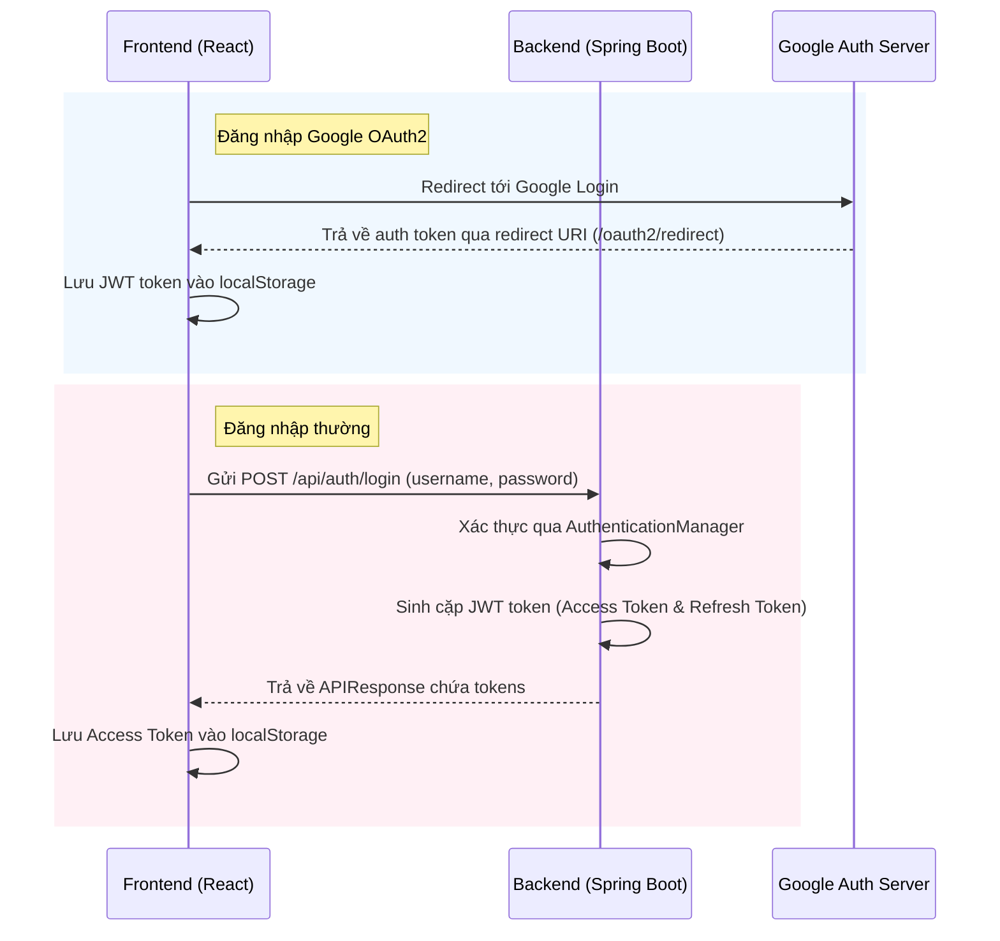

# TÀI LIỆU HƯỚNG DẪN DỰ ÁN EDUSPACE (PROJECT GUIDE)

> **Mô tả ngắn**: Tài liệu này mô tả chi tiết kiến trúc, các công nghệ (Tech Stack), cấu trúc thư mục, các luồng hoạt động chính, thư viện sử dụng và các quy tắc phát triển (guidelines) của dự án **SWP391-Group2-EduSpace (EduSpace)**. Được thiết kế chuyên biệt để các AI Agent (Cursor, Antigravity, Cline, ChatGPT, Gemini, v.v.) có thể nhanh chóng đọc và hiểu rõ toàn bộ dự án.

---

## 1. TỔNG QUAN DỰ ÁN & CÁC TÍNH NĂNG CHÍNH

**EduSpace** là một hệ thống quản lý học tập trực tuyến (LMS - Learning Management System) phân quyền cao dành cho ba vai trò chính: Học viên (User/Student), Giảng viên (Creator/Instructor) và Quản trị viên (Admin).

Các tính năng cốt lõi đã và đang được triển khai bao gồm:

- **Xác thực & Phân quyền**: Đăng nhập/Đăng ký thông thường, Đăng nhập qua bên thứ ba (Google OAuth2). Quản lý phiên đăng nhập qua Token-based auth (JWT) với auto-refresh và phân quyền chặt chẽ thông qua Route Guards.
- **Vòng đời khóa học (Course Lifecycle)**: Tạo khóa học, cập nhật nội dung bài học/chương học, gửi duyệt khóa học lên hệ thống, và quản lý hiển thị cho Creator.
- **Tiến độ học tập (Learning & Progress)**: Xem danh sách bài học, học thử/học chính thức qua video, đọc tài liệu, theo dõi trạng thái hoàn thành bài học và biểu đồ dashboard phân tích tiến trình học tập cá nhân.
- **Lộ trình học tập (Roadmap)**: Tạo lập và hiển thị lộ trình học tập trực quan, cho phép kéo thả (Drag and Drop) các chương trình/khóa học vào lộ trình.
- **Nhóm học tập & Lớp học (Study Groups & Classes)**:
  - Hỗ trợ học viên tham gia lớp học cụ thể thuộc khóa học (`CourseClass`).
  - Tham gia nhóm học tập cộng tác (`StudyGroup`), quản lý thành viên, danh sách chờ duyệt (`Waitlist`), lịch trình học tập (`ClassTimeline`).
- **Bài tập & Nộp bài (Assignments & Submissions)**: Giao bài tập cho học viên trong lớp học và cho phép học viên nộp bài, xem lịch sử nộp bài và nhận điểm số/đánh giá từ giảng viên.
- **Chứng chỉ (Certificates)**: Tự động cấp chứng chỉ hoàn thành khóa học dưới dạng số khi học viên hoàn tất 100% nội dung học tập.

---

## 2. CÔNG NGHỆ & THƯ VIỆN SỬ DỤNG (TECH STACK)

### 2.1. Frontend (Client)

- **Framework**: React 19 (Vite)
- **Routing**: React Router v7 (sử dụng gói `react-router` mới nhất)
- **Styling**: Tailwind CSS v4.0.0 (tích hợp trực tiếp với compiler của Vite qua plugin `@tailwindcss/vite`)
- **Font & Typography**: `@fontsource-variable/geist` (Variable font hiện đại)
- **UI Components & Icons**:
  - **Shadcn UI**: Xây dựng dựa trên các component headless của **Radix UI** và cấu hình style bằng **class-variance-authority** + **tailwind-merge**.
  - **Lucide React** & **React Icons**: Bộ icon phong phú, đồng bộ.
  - **Sonner**: Thư viện hiển thị thông báo (toast) đẹp mắt, hỗ trợ rich-colors.
  - **NProgress**: Hiển thị thanh tiến trình loading chạy trên đỉnh màn hình khi có request mạng.
- **API Client**: Axios (được cấu hình tự động đính kèm JWT Token vào Header qua Interceptor và tích hợp NProgress).
- **Tương tác**: `@hello-pangea/dnd` (Drag and Drop cho các tính năng sắp xếp roadmap/danh sách).

### 2.2. Backend (Server)

- **Ngôn ngữ & Phiên bản**: Java 21
- **Framework**: Spring Boot 4.0.6 (quản lý build và dependencies bằng Maven)
- **Database**: MySQL (kết nối qua `mysql-connector-j`)
- **Tầng dữ liệu (ORM)**: Spring Data JPA (sử dụng Hibernate)
- **Bảo mật & Xác thực**:
  - **Spring Security**: Cấu hình xác thực và phân quyền truy cập API.
  - **Spring Boot Starter OAuth2 Client**: Hỗ trợ tích hợp đăng nhập qua tài khoản Google.
  - **JWT (JSON Web Token)**: Sử dụng gói `io.jsonwebtoken` (api, impl, jackson phiên bản 0.11.5) để sinh và giải mã token.
- **Xác thực dữ liệu (Validation)**: Spring Boot Starter Validation (`jakarta.validation`).
- **Tài liệu API**: Springdoc OpenAPI UI (Swagger) để hiển thị danh sách API và test nhanh.
- **Công cụ hỗ trợ**:
  - **Lombok**: Giảm thiểu code Boilerplate (Getter, Setter, Constructor, Builder).
  - **Jackson Databind**: Xử lý parse JSON dữ liệu.
  - **Jakarta Mail**: Hỗ trợ gửi mail thông báo/mật khẩu tự động.

---

## 3. CẤU TRÚC THƯ MỤC CHI TIẾT

### 3.1. Cấu trúc Frontend (`/frontend`)

Frontend được tổ chức theo kiến trúc **Modular (Module-based)** để dễ dàng mở rộng, cô lập các tính năng và tránh việc files bị phân mảnh.

```text
frontend/
├── package.json                   # Cấu hình dự án React + thư viện sử dụng
├── vite.config.js                 # Cấu hình build Vite và Tailwind CSS v4
├── index.html                     # Entry HTML file
├── src/
│   ├── components/                # Thư mục chứa components dùng chung toàn hệ thống
│   │   ├── ui/                    # Các custom component của Shadcn UI (Button, Input, Badge, Dialog, v.v.)
│   │   └── common/                # Layouts dùng chung, header, footer, NProgress Bar, Protected Routes
│   ├── contexts/                  # Quản lý Global State (AuthContext cung cấp useAuth() xử lý đăng nhập, session)
│   ├── lib/                       # Nơi cấu hình thư viện bên thứ 3 (axios.js định cấu hình interceptor cho JWT)
│   ├── utils/                     # Các utility helper như xử lý loading (runWithLoading), định dạng ngày tháng
│   ├── routes/                    # Định nghĩa cấu hình route nâng cao (ProtectedRoute bảo vệ các trang yêu cầu đăng nhập)
│   ├── services/                  # Tầng giao tiếp API (authService.js, courseService.js...)
│   ├── views/                     # [MANDATORY] Điểm định tuyến (Router Entry Points) bọc Layout và gọi module page
│   └── modules/                   # [MANDATORY] Chứa các tính năng tách riêng theo module
│       ├── auth/                  # Module Login, Register, Google Callback
│       ├── course-lifecycle/      # Module tạo, xem chi tiết, chỉnh sửa khóa học, analytics cho Creator
│       ├── learning/              # Module khu vực học tập (LearningArea), My Learning, Progress Dashboard
│       ├── roadmap/               # Module hiển thị và quản lý lộ trình học tập
│       └── shared-features/       # Module hồ sơ người dùng (UserProfile)
```

Mỗi module trong `src/modules/<feature-name>` tuân thủ theo cấu trúc blueprint:

```text
src/modules/<feature-name>/
├── components/                    # Các component trình diễn (Dumb Components) phục vụ riêng module này
├── pages/                         # Các trang hoàn chỉnh (Smart Page/Container Components)
├── hooks/                         # Các custom hook nội bộ để xử lý logic, state cho module
├── utils/                         # Helper hoặc mock data của riêng module
└── index.js                       # Điểm export duy nhất các Page components ra bên ngoài
```

### 3.2. Cấu trúc Backend (`/backend`)

Backend được tổ chức theo kiến trúc phân tầng chuẩn (**Layered Architecture**):

```text
backend/
├── pom.xml                        # Khai báo thư viện (dependencies) và cấu hình Maven
├── src/
│   ├── main/
│   │   ├── java/org/eduspace/backend/
│   │   │   ├── BackendApplication.java  # Khởi chạy dự án Spring Boot
│   │   │   ├── config/            # Cấu hình CORS, cấu hình hệ thống chung
│   │   │   ├── controller/        # Tầng API REST: nhận HTTP requests từ client, trả về DTO
│   │   │   ├── dto/               # Data Transfer Objects (DTO)
│   │   │   │   ├── request/       # DTO định nghĩa cấu trúc dữ liệu gửi từ client lên (VD: RegisterRequest)
│   │   │   │   └── response/      # DTO định nghĩa cấu trúc dữ liệu trả về cho client (VD: UserResponse)
│   │   │   ├── entity/            # Thực thể JPA (Database Models) ánh xạ trực tiếp với MySQL tables
│   │   │   ├── enums/             # Chứa các Enum định nghĩa hằng số hệ thống (Role, CourseStatus, v.v.)
│   │   │   ├── exception/         # Xử lý custom exception và Global Exception Handler (trả format lỗi đồng nhất)
│   │   │   ├── helper/            # Các helper trung gian xử lý nghiệp vụ nhỏ
│   │   │   ├── repository/        # Tầng Database Access: JPA repositories thao tác với Database (CRUD)
│   │   │   ├── security/          # Spring Security, cấu hình xác thực JWT, bảo vệ API
│   │   │   └── service/           # Tầng Business Logic: giải quyết nghiệp vụ cốt lõi
│   │   └── resources/
│   │       ├── application.properties   # Cấu hình chính (chỉ định kết nối MySQL, JWT secret, email qua .env.properties)
│   │       └── static / templates       # Tài nguyên tĩnh/template (ít sử dụng)
│   └── test/                      # Thư mục chứa unit tests, integration tests
```

---

## 4. MA TRẬN PHÂN QUYỀN & CÁC ROUTE CHÍNH

Hệ thống quản lý phân quyền nghiêm ngặt dựa trên vai trò của người dùng (`USER`, `CREATOR`, `ADMIN`).

| Tính năng / Route                                    | GUEST | USER | CREATOR | ADMIN |
| :--------------------------------------------------- | :---: | :--: | :-----: | :---: |
| **Xem danh sách/chi tiết khóa học**                  |  ✅   |  ✅  |   ✅    |  ✅   |
| **Đăng ký học / Vào lớp học (`/courses/:id/learn`)** |  ❌   |  ✅  |   ❌    |  ❌   |
| **Đăng ký làm Creator**                              |  ❌   |  ✅  |   ❌    |  ❌   |
| **Tạo/Sửa khóa học (`/creator/*`)**                  |  ❌   |  ❌  |   ✅    |  ❌   |
| **Xem phân tích doanh thu/học viên**                 |  ❌   |  ❌  |   ✅    |  ❌   |
| **Phê duyệt đơn đăng ký Creator**                    |  ❌   |  ❌  |   ❌    |  ✅   |
| **Duyệt/Khóa các khóa học hệ thống**                 |  ❌   |  ❌  |   ❌    |  ✅   |

### 4.1. Chi tiết phân chia Route ở `App.jsx`

- **Public Routes**: `/` (Trang chủ), `/signup` (Đăng ký), `/login` (Đăng nhập), `/oauth2/redirect` (Xử lý Google Callback), `/roadmaps` (Lộ trình), `/courses` (Danh sách khóa học).
- **Authenticated User Routes**:
  - `/profile`: Quản lý thông tin cá nhân.
  - `/courses/:courseId/learn`: Khu vực học tập (LearningArea) gồm video và bài học.
  - `/courses/:courseId/dashboard`: Dashboard phân tích tiến trình học.
  - `/my-learning`: Quản lý các khóa học đã đăng ký tham gia.
- **Creator Routes (Yêu cầu role `CREATOR`)**:
  - `/creator`: Dashboard tổng quan của giảng viên.
  - `/creator/courses`: Danh sách khóa học giảng viên tự tạo.
  - `/creator/courses/:id`: Xem chi tiết khóa học phía creator.
  - `/creator/courses/:id/edit`: Trình xây dựng khóa học (Course Builder) dạng chỉnh sửa.
  - `/creator/courses/:id/view`: Trình xây dựng khóa học dạng xem thử.
  - `/creator/analytics`: Phân tích số liệu học viên, tiến độ và doanh số.
  - `/creator/create-course`: Tạo khóa học mới.
- **Admin Routes (Yêu cầu role `ADMIN`)**:
  - `/admin`: Dashboard điều hành của Admin.
  - `/admin/creator-requests`: Danh sách phê duyệt đơn đăng ký nâng cấp lên Creator.
  - `/admin/courses-management`: Phê duyệt các khóa học mới do Creator gửi lên trước khi phát hành công khai.

---

## 5. LUỒNG HOẠT ĐỘNG CHÍNH (FLOW OF OPERATIONS)

### 5.1. Luồng Xác thực (Authentication Flow)



Khi có token trong `localStorage`:

1. **Axios Interceptor** (`frontend/src/lib/axios.js`) sẽ tự động lấy token và đính kèm vào Header `Authorization: Bearer <token>` cho mọi request gửi đi.
2. Interceptor tự động gọi `NProgress.start()` khi bắt đầu gửi request và `NProgress.done()` khi nhận phản hồi để hiển thị thanh tiến trình loading chạy trên đỉnh màn hình.

### 5.2. Luồng Yêu cầu & Phản hồi Dữ liệu (Request & Response Lifecycle)

Khi một màn hình Frontend cần lấy hoặc ghi dữ liệu từ Backend:

1. **View Wrapper** (`src/views/`) import **Smart Page** (`src/modules/*/pages/`) và áp dụng layouts (Header, Footer, Sidebar).
2. **Smart Page** sử dụng **Custom Hook** cục bộ của module (ví dụ: `useMyLearning.js`).
3. **Custom Hook** gọi hàm từ **Service Layer** (ví dụ: `courseService.js`).
4. **Service Layer** thực hiện gửi request qua Axios instance `api` đã cấu hình.
5. **Backend Controller** tiếp nhận HTTP request:
   - Chuyển JSON thành đối tượng **Request DTO** và validate các trường nhập liệu (`@Valid`).
   - Trả về lỗi `400 Bad Request` dạng danh sách các lỗi validation ngăn cách bởi dấu phẩy nếu dữ liệu không hợp lệ.
6. **Backend Service** thực thi các logic nghiệp vụ, lấy thông tin từ database qua **Repository** và map kết quả từ **Entity** sang **Response DTO**.
7. **Response DTO** được đóng gói bên trong đối tượng chuẩn `APIResponse<T>` gồm:
   ```json
   {
     "isSuccess": true,
     "code": 200,
     "message": "Thao tác thành công",
     "data": { ... }
   }
   ```
8. **Frontend Service** tiếp nhận phản hồi:
   - Nếu thành công: Trả về trực tiếp phần payload `response.data.data` cho Component.
   - Nếu có lỗi: Ném ngoại lệ `throw new Error(errorMsg)` lấy từ `message` của phản hồi Backend.
9. **Smart Page/Custom Hook** bắt lỗi (`catch`) và hiển thị thông báo trực tiếp lên màn hình qua `toast.error(error.message)` của thư viện **Sonner**.

---

## 6. HƯỚNG DẪN QUAN TRỌNG DÀNH CHO AI AGENT (DEVELOPMENT RULES)

Để đảm bảo hiệu quả làm việc cao nhất, tránh xung đột code và giữ an toàn cho codebase khi phát triển dự án này, các AI Agent **bắt buộc** phải tuân theo các nguyên tắc sau:

### 6.1. Quy ước đặt tên (Naming Conventions)

| Loại thành phần         | Quy tắc đặt tên               | File mẫu            | Ví dụ cụ thể                                     |
| :---------------------- | :---------------------------- | :------------------ | :----------------------------------------------- |
| **Common/UI Component** | PascalCase                    | `<Name>.jsx`        | `Button.jsx`, `ReloadButton.jsx`                 |
| **Module Component**    | PascalCase                    | `<Name>.jsx`        | `LoginForm.jsx`, `CourseCard.jsx`                |
| **Page Component**      | PascalCase + Hậu tố `Page`    | `<Name>Page.jsx`    | `MyLearningPage.jsx`, `CreatorAnalyticsPage.jsx` |
| **Custom React Hook**   | camelCase + Tiền tố `use`     | `use<Name>.js`      | `useAuth.js`, `useMyLearning.js`                 |
| **React Context**       | PascalCase + Hậu tố `Context` | `<Name>Context.jsx` | `AuthContext.jsx`                                |
| **Service Layer**       | camelCase + Hậu tố `Service`  | `<name>Service.js`  | `authService.js`, `courseService.js`             |
| **Utility Helper**      | camelCase                     | `<name>.js`         | `utils.js`, `dateFormatter.js`                   |
| **Thư mục Module**      | kebab-case                    | `<name>/`           | `course-lifecycle/`, `shared-features/`          |

### 6.2. Quy tắc phát triển Frontend (Frontend Rules)

1. **Cô lập Module (Module Isolation)**:
   - Tất cả các trang hoặc component nghiệp vụ mới bắt buộc phải nằm trong thư mục `src/modules/<feature-name>`.
   - Tránh tạo page lớn trực tiếp ở thư mục `src/views` mà không đi qua module. Thư mục `src/views` chỉ dùng để bọc layout (Header, Footer) và gọi component page của module tương ứng.
2. **Không tự cài đặt thư viện quản lý State / Data Fetching**:
   - Dự án sử dụng `useState` cho local state và `React Context` (`AuthContext`) cho global state. **Nghiêm cấm tự cài đặt** `Redux`, `Zustand`, `MobX`, `React Query (TanStack Query)`, `SWR` khi chưa được phê duyệt.
3. **Controlled Form Pattern**:
   - Phát triển form sử dụng state `useState` của React (Controlled Component). **Nghiêm cấm** sử dụng `react-hook-form` để duy trì tính đơn giản của codebase.
   - Vô hiệu hóa (disable) tất cả `Input`, `Select`, `Button` của form khi trạng thái submit `isLoading` đang bằng `true`.
4. **Nhất quán Styling**:
   - Dự án sử dụng Tailwind CSS v4 và Geist font. Không tự ý viết CSS tùy biến hoặc sử dụng màu sắc lạ ngoài bộ biến màu HSL định nghĩa sẵn trong `index.css` (VD: Hãy dùng `bg-primary`, `bg-secondary`, `text-neutral-dark`, `border-border-light`, v.v.).
5. **Giao tiếp API**:
   - Luôn sử dụng instance `api` được cấu hình từ `@/lib/axios.js` để thực hiện call HTTP. Tách biệt hoàn toàn các hàm gọi mạng này vào file service tương ứng tại `src/services/`.
   - Khi thực hiện tác vụ bất đồng bộ cần hiển thị loading, sử dụng helper `runWithLoading(setLoading, asyncFn)` để tránh việc viết lặp lại các khối `try-catch-finally` set state loading.
6. **Alias Import**:
   - Sử dụng alias `@/` khi thực hiện import để tránh các đường dẫn tương đối phức tạp (VD: `import Button from "@/components/ui/Button"` thay vì `import Button from "../../../components/ui/Button"`).
7. **Lệnh Build kiểm tra**:
   - Sau khi chỉnh sửa Frontend, Agent cần chạy thử lệnh `npm run build` để kiểm tra lỗi cú pháp và lỗi import (tránh lỗi case-sensitive trên môi trường CI/CD Linux).

### 6.3. Quy tắc phát triển Backend (Backend Rules)

1. **APIResponse Contract**:
   - Toàn bộ REST Controllers khi trả dữ liệu về client bắt buộc phải bao bọc kết quả trong cấu trúc lớp `APIResponse<T>`.
2. **Global Exception Handler**:
   - Khi gặp lỗi nghiệp vụ, hãy ném trực tiếp custom runtime exception phù hợp. Global Exception Handler sẽ tự động bắt, ghi log và chuẩn hóa format lỗi JSON trả về cho Frontend.
3. **DTO Mapping**:
   - Không trả thực thể JPA (`Entity`) trực tiếp về client. Luôn chuyển đổi sang `Response DTO` ở tầng Service để tránh rò rỉ thông tin nhạy cảm và lỗi vòng lặp tuần tự hóa (circular serialization).
